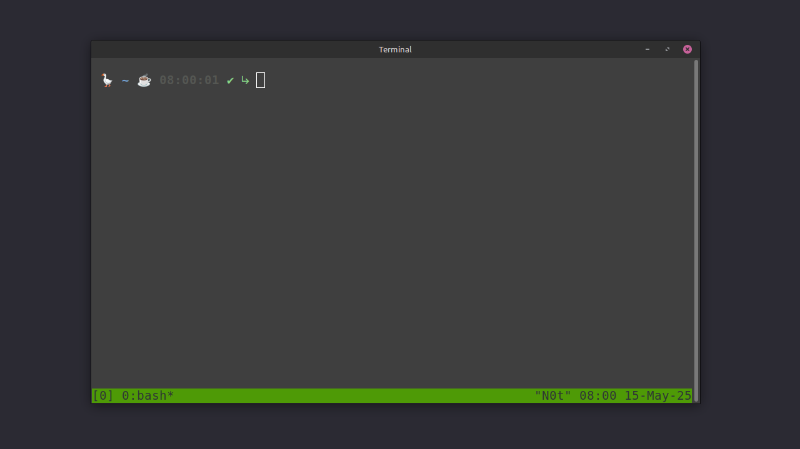

# starship-config

Starship Configuration for Bash
My personal Starship prompt config for a clean and fast terminal look.

This `starship.toml` file is a custom configuration for the Bash shell, designed to display useful and engaging information in your command prompt. By using this configuration, your terminal will not only become more functional but also gain a personal and unique look.

## Prerequisites

* **Starship:** To use this file, you need to have [Starship](https://starship.rs/) installed on your system. Starship is a cross-platform, fast, and infinitely customizable prompt for any shell.
* **Bash:** This configuration is specifically designed for the Bash shell.

## Installation & Setup

1.  **Download the file:** First, download the `starship.toml` file from this GitHub repository.
2.  **File Location:** Move the downloaded file to the default Starship configuration directory. This is usually one of the following:
    * `~/.config/starship.toml`
    * `~/.starship.toml`
3.  **Apply Changes:** After placing the file in the correct directory, Starship will automatically apply the new configuration in your Bash terminal. If your terminal is open, close and reopen it to see the changes.

## Configuration Explanation

Below is an explanation of each section of the Starship configuration defined in this file:

* `format = ' 🪿 $username$hostname$localip$directory$git_branch$git_commit$git_state$git_status$conda$python$nodejs$java$rust$golang$docker_context$time$character '`: This line defines the overall format of the command prompt. Each `$module_name` is a Starship module that displays specific information. The 🪿 emoji at the beginning adds a geeky touch.

* `[username]`: Settings related to the username.
    * `style_user = "bold green"`: The regular username is displayed in bold green.
    * `style_root = "bold red"`: The root username is displayed in bold red to remind you of elevated privileges.
    * `format = "[$user]($style) "`: The format for displaying the username is `[username]` with the defined style.
    * `disabled = false`: Display of the username is enabled.

* `[hostname]`: Settings related to the hostname (displayed only on SSH connections).
    * `ssh_only = true`: Only displayed when connected to the system via SSH.
    * `format = 'on [$hostname](bold yellow) '`: The format for displaying the hostname is `on hostname` in bold yellow.
    * `trim_at = "."`: If the hostname contains a dot, parts after the first dot are removed.
    * `disabled = false`: Display of the hostname is enabled.

* `[localip]`: Settings related to the local IP address (displayed only on SSH connections).
    * `ssh_only = true`: Only displayed when connected to the system via SSH.
    * `format = '📟 [$localipv4](bold red) '`: The format for displaying the local IPv4 address with a 📟 emoji in bold red.
    * `disabled = false`: Display of the local IP address is enabled.

* `[time]`: Settings related to displaying the time.
    * `disabled = false`: Display of the time is enabled.
    * `style = "bold bright-black"`: The time is displayed in bold bright-black.
    * `format = "[$time]($style) "`: The format for displaying the time is `[HH:MM]` with the defined style.

* `[directory]`: Settings related to displaying the current directory.
    * `truncation_length = 10`: If the directory path has more than 10 segments, it will be truncated.
    * `truncate_to_repo = true`: If inside a Git repository, the path will be truncated to the repository root.
    * `style = "bold italic blue"`: The current directory is displayed in bold italic blue.

* `[line_break]`: Settings related to line breaks. Disabled here (`disabled = true`).

* `[character]`: Settings related to the final character of the prompt (success or error indicator).
    * `success_symbol = "[✔ ﬌](fg:#88cc88)"`: The success symbol is displayed as ✔ with a special character and in bright green.
    * `error_symbol = "[✗ ﬌](fg:#ff6b6b)"`: The error symbol is displayed as ✗ with a special character and in bright red.
    * `format = "$symbol"`: Only the symbol (success or error) is displayed.
    * `disabled = false`: Display of the character is enabled.

* `[git_branch]`: Settings related to displaying the Git branch.
    * `disabled = false`: Display of the Git branch is enabled.
    * `symbol = "🌿 "`: The 🌿 emoji is used as a prefix for the branch name.
    * `style = "fg:#88B6A2"`: The branch name is displayed in a greenish-blue color.
    * `truncation_length = 5`: If the branch name is longer than 5 characters, it will be truncated.
    * `format = '[$symbol$branch(:$remote_branch)]($style) '`: The format for displaying the branch is `🌿 local_branch(:remote_branch)` with the defined style.

* `[git_commit]`: Settings related to displaying the last Git commit hash.
    * `disabled = false`: Display of the Git commit hash is enabled.
    * `commit_hash_length = 1`: Only one character of the commit hash is displayed.

* `[git_state]`: Settings related to displaying the Git state (e.g., rebasing, merging).
    * `disabled = false`: Display of the Git state is enabled.
    * `rebase = "⤴ rebasing"`: Displays "⤴ rebasing" during a rebase.
    * `merge = "🔀 merging"`: Displays "🔀 merging" during a merge.
    * Other Git states are defined similarly.

* `[git_status]`: Settings related to displaying the status of Git files (modified, staged, etc.).
    * `disabled = false`: Display of the Git file status is enabled.
    * `style = "fg:#88B6A2"`: The file status is displayed in a greenish-blue color.
    * `stashed = "📦 ${count} "`, `ahead = "⬆️ ${count} "`, `behind = "⬇️ ${count} "`, and other statuses are displayed with relevant emojis and counts.

* `[java]`: Settings related to displaying Java status.
    * `disabled = false`: Display of Java status is enabled.
    * `symbol = "☕ "`: The ☕ emoji is used as the Java symbol.
    * `format = '[${symbol}]($style)'`: The format for displaying the Java symbol with the defined style.
    * `style = "fg:#88B6A2"`: The style of the Java symbol.

* `[python]`: Settings related to displaying Python status (version and virtual environment).
    * `symbol = "🐍 "`: The 🐍 emoji is used as the Python symbol.
    * `format = 'via [${symbol}python (${version} )(\($virtualenv\) )]($style)'`: The format for displaying the Python symbol, version, and (if active) virtual environment name.
    * `style = "fg:#88B6A2"`: The style of the Python section.

* `[lua]`: Settings related to displaying Lua status.
    * `disabled = false`: Display of Lua status is enabled.
    * `symbol = "🌙 "`: The 🌙 emoji is used as the Lua symbol.
    * `format = '[${symbol}]($style)'`: The format for displaying the Lua symbol with the defined style.
    * `style = "fg:#88B6A2"`: The style of the Lua symbol.

* `[nodejs]`: Settings related to displaying Node.js status.
    * `disabled = false`: Display of Node.js status is enabled.
    * `symbol = "🟢 "`: The 🟢 emoji is used as the Node.js symbol.
    * `format = '[${symbol}]($style)'`: The format for displaying the Node.js symbol with the defined style.
    * `style = "fg:#88B6A2"`: The style of the Node.js symbol.

* `[package]`: Settings related to displaying Package Manager status (e.g., npm, pip).
    * `disabled = false`: Display of Package Manager status is enabled.
    * `symbol = "📦 "`: The 📦 emoji is used as the Package Manager symbol.
    * `display_private = false`: Private packages are not displayed.
    * `format = '[${symbol}]($style)'`: The format for displaying the Package Manager symbol with the defined style.
    * `style = "fg:#88B6A2"`: The style of the Package Manager symbol.

* `[conda]`: Settings related to displaying Conda environment status.
    * `symbol = "🧪📦 "`: The 🧪📦 emoji is used as the Conda symbol.
    * `style = "fg:#88B6A2"`: The style of the Conda section.
    * `format = 'via [$symbol$environment]($style) '`: The format for displaying the Conda symbol and environment name.
    * `disabled = false`: Display of Conda status is enabled.

* `[docker_context]`: Settings related to displaying Docker context status.
    * `symbol = "🐳 "`: The 🐳 emoji is used as the Docker symbol.
    * `format = "via [$symbol$context]($style) "`: The format for displaying the Docker symbol and context name.
    * `style = "fg:#88B6A2"`: The style of the Docker section.
    * `only_with_files = true`: Only displayed when the specified files in `detect_files` are present.
    * `detect_files = ["docker-compose.yml", "docker-compose.yaml", "Dockerfile"]`: Files whose presence triggers the display of this section.
    * `detect_folders = []`: Folders whose presence triggers the display of this section (empty here).
    * `disabled = false`: Display of Docker status is enabled.

* `[golang]`: Settings related to displaying Go status.
    * `disabled = false`: Display of Go status is enabled.
    * `symbol = "🐹 "`: The 🐹 emoji is used as the Go symbol.
    * `format = '[${symbol}]($style)'`: The format for displaying the Go symbol with the defined style.
    * `style = "fg:#88B6A2"`: The style of the Go symbol.

* `[rust]`: Settings related to displaying Rust status.
    * `disabled = false`: Display of Rust status is enabled.
    * `symbol = "🦀 "`: The 🦀 emoji is used as the Rust symbol.
    * `format = '[${symbol}]($style)'`: The format for displaying the Rust symbol with the defined style.
    * `style = "fg:#88B6A2"`: The style of the Rust symbol.

## Screenshots

## Contributing

If you have any suggestions or ideas for improving this configuration, feel free to submit a Pull Request or open an Issue in this repository.

## License

MIT LICENSE
